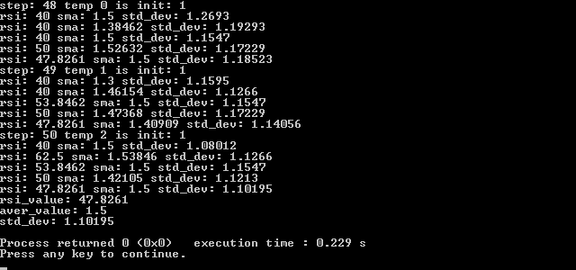

# xtechnical_analysis
C++ header-only библиотека технического анализа для алготрейдинга

## Индикаторы

Библиотека содержит одиночные индикаторы и один универсальный индикатор MW (который может выполнять функцию сразу нескольких индикаторов).

## Особенности реализации индикаторов

Индикаторы имеют два метода для загрузки ценовых значений. Первый метод называется *update*, он меняет внутреннее состояние индикатора. Данный метод необходимо вызывать в момент закрытия бара.
Метод *test* индикаторов позволяет узнать значение индикатора еще не сформировавшемся полностью баре. Данный метод по сути берет "пробу", давая знать, какое значение у индикатора сейчас при текущей цене.
Метод *test* не влияет на внутреннее состояние индикатора: индикатор не запомнит цену, переданную в методе *test*. Однако, метод *test* переключает индикатор на режми "теста", поэтому все другие методы индикатора будут возвращать значения, актуальные для цены, переданной в методе *test*.

Данный подход позволяет очень просто использовать индикаторы на графике, когда необходимо перерисовывать значения индикаторов на еще не сформировавшихся барах с приходом новых тиков.

### Стандартные индикаторы

* RSI с возможностью использовать любые скользящие средние
* BollingerBands
* CMA - Кумулятивное скользящее среднее
* VCMA - Кумулятивное скользящее среднее с реализацией взвешенности по объему.
* SMA
* WMA
* VWMA - модифицированная скользящая средняя с реализацией взвешенности по объему.
* EMA
* MMA
* AMA
* NoLagMa - МА без задержки
* LowPassFilter - ФНЧ
* AverageSpeed - (индикатор не проверен!)
* CurrencyCorrelation - (вычисление корреляции)
* DetectorWaveform - (индикатор не проверен! экспериментальный индикатор)
* DelayEvent - Линия задержки события
* DelayLine - Линия задержки (индикатор не проверен!)
* OsMa - скользящее среднее индикатора осциллятора (индикатор не проверен!)

### Индикатор MW

Основной упор идет на разрабюотку универсального индкатора. В данной библиотеке это индикатор *"скользящее окно"* или сокращенно *MW*.

Класс MW имеет несколько методов для получения различных данных анализируемых котировок.

* Конструктор *MW* - в конструкторе можно задать максимальный период скользящего окна.

```cpp
/** \brief Инициализировать скользящее окно
 * \param period период
 */
MW(const size_t period);
```

* Метод *is_init()* - данный метод вернет true, когда буфер скользящего окна будет полностью заполнен. Т.е. когда скользящее окно будет содержать в себе максимальное возможное количество котировок.

```cpp
/** \brief Проверить инициализацию буфера скользящего окна
 * \return Вернет true, если буфер скользящего окна полностью заполнен значениями.
 */
bool is_init();
```

* Метод *update* - данный метод необходимо вызывать каждый раз, когда необходимо загрузить в индикатор новое значение котировок. Данный метод имеет несколько разновидностей:

```cpp
/** \brief Обновить состояние индикатора
 * \param in сигнал на входе (котировка, цена закрытия/открытия бара и пр.)
 * \return вернет 0 в случае успеха, иначе см. ErrorType
 */
int update(const T &in);
		
/** \brief Обновить состояние индикатора
 * \param in сигнал на входе (котировка, цена закрытия/открытия бара и пр.)
 * \param out массив на выходе
 * \return вернет 0 в случае успеха, иначе см. ErrorType
 */
int update(const T &in, std::vector<T> &out);
```
* Метод *test* - данный метод похож на метод *update*, но имеет принципиальную разницу. **Этот метод не влияет на внутреннее состояние индикатора.** Данный метод нужен для "тестирования" индикатора, т.е. для получения значения индикатра без изменения внутненнего состояния. Этот метод может пригодится, когда нужно получить, к примеру, значение RSI по текущей котировке, но сам индикатор должен рассчитываться только по ценам закрытия бара.

```cpp
/** \brief Протестировать индикатор
 * Данная функция отличается от update тем, что не влияет на внутреннее состояние индикатора
 * \param in сигнал на входе
 * \return вернет 0 в случае успеха, иначе см. ErrorType
 */
int test(const T &in);
		
/** \brief Протестировать индикатор
 * Данная функция отличается от update тем, что не влияет на внутреннее состояние индикатора
 * \param in сигнал на входе
 * \param out сигнал на выходе
 * \return вернет 0 в случае успеха, иначе см. ErrorType
 */
int test(const T &in, std::vector<T> &out);
```

В зависимости от того, какой метод был выбран (*update* или *test*), остальные методы для получения тех или иных значений будут использовать временный буфер (*содержащий последнюю котировку из метода test*) или основной буфер (*который меняется только от метода update*) индикатора.

* Метод get_data - позволяет получить буфер (основной или тестовый).

```cpp
/** \brief Получить данные внутреннего буфера индикатора
 * \param buffer буфер
 */
void get_data(std::vector<T> &buffer);
```

* Методы *get_max_value* и *get_min_value* позволяют получить максимальное и минимальное значение из основного или тестового буфера. 

**Внимание! Убедитесь, что буфер содержит минимум N = *period* значений!**

```cpp
/** \brief Получить максимальное значение буфера
 * \param max_value Максимальное значение
 * \param period Период максимальных данных
 * \param offset Смещение в массиве. По умолчанию 0
 */
void get_max_value(T &max_value, const size_t period, const size_t offset = 0);
```

* Метод *get_average* позволяет получить среднее значение из основного или тестового буфера.

**Внимание! Убедитесь, что буфер содержит минимум N = *period* значений!**

```cpp
/** \brief Получить среднее значение буфера
 * \param average_value Среднее значение
 * \param period Период среднего значения
 * \param offset Смещение в массиве. По умолчанию 0
 */
void get_average(T &average_value, const size_t period, const size_t offset = 0);
```

* Метод *get_std_dev* позволяет получить стандартное отклонение из основного или тестового буфера.

**Внимание! Убедитесь, что буфер содержит минимум N = *period* значений!**

```cpp
/** \brief Получить стандартное отклонение буфера
 * \param std_dev_value Стандартное отклонение
 * \param period Период стандартного отклонения
 * \param offset Смещение в массиве. По умолчанию 0
 */
void get_std_dev(T &std_dev_value, const size_t period, const size_t offset = 0)
```

* Метод *get_average_and_std_dev_array* позволяет получить массив среднего значения и стандартноого отклонения из основного или тестового буфера.

**Внимание! Убедитесь, что буфер содержит минимум N = *period* значений!**

```cpp
/** \brief Получить массив средних значений и стандартного отклонения буфера
 *
 * Минимальный период равен 2
 * \param average_data массив средних значений
 * \param std_data массив стандартного отклонения
 * \param min_period минимальный период
 * \param min_period максимальный период
 * \param step_period шаг периода
 */
void get_average_and_std_dev_array(
		std::vector<T> &average_data,
		std::vector<T> &std_data,
		size_t min_period,
		size_t max_period,
		const size_t &step_period);
```

* Метод *get_rsi* позволяет получить значение RSI из основного или тестового буфера.

**Внимание! Убедитесь, что буфер содержит минимум N = *period + 1* значений!**

```cpp
/** \brief Получить значение RSI
 * \param rsi_value Значение RSI
 * \param period Период RSI
 */
void get_rsi(T &rsi_value, const size_t period);
```

* Метод *get_rsi_array* позволяет получить массив значений RSI из основного или тестового буфера.

**Внимание! Убедитесь, что буфер содержит минимум N = *max_period + 1* значений!**

```cpp
/** \brief Получить массив значений RSI
 * \param rsi_data массив значений RSI
 * \param min_period минимальный период
 * \param max_period максимальный период
 * \param step_period шаг периода
 */
void get_rsi_array(
		std::vector<T> &rsi_data,
		size_t min_period,
		size_t max_period,
		const size_t &step_period);
```

* Метод *clear()* очищает внутреннее состояние индикатора. Он обнуляет размер основного и тестового буфера.

```cpp
/** \brief Очистить данные индикатора
 */
void clear();
```

### Пример программы

```cpp
#include <iostream>
#include "xtechnical_indicators.hpp"

using namespace std;

int main() {
    cout << "Hello world!" << endl;
	/* индикатор "скользящее окно" с максимальным периодом 30 */
    xtechnical_indicators::MW<double> iMW(30);
	
	/* загрузим в индикатор тестовые значения */
    for(int i = 1; i <= 50; ++i) {
        int temp = i % 4; // значение от 0 до 3 в зависимости от номера интерации
        iMW.update(temp);
		/* получим массивы значений индикаторов */
        std::vector<double> rsi;
        std::vector<double> sma;
        std::vector<double> std_dev;
        iMW.get_rsi_array(rsi, 3, 15, 3);
        iMW.get_average_and_std_dev_array(sma, std_dev, 10, 22, 3);

        std::cout << "step: " << i << " temp " << temp << " is init: " << iMW.is_init() << std::endl;
        for(size_t i = 0; i < sma.size(); ++i) {
            std::cout << "rsi: " << rsi[i] << " sma: " << sma[i] << " std_dev: " << std_dev[i] << std::endl;
        }
    }

    double rsi_value = 0;
    iMW.get_rsi(rsi_value, 15);
    std::cout << "rsi_value: " << rsi_value << std::endl;
    double aver_value = 0;
    iMW.get_average(aver_value, 22);
    std::cout << "aver_value: " << aver_value << std::endl;
    double std_dev_value = 0;
    iMW.get_std_dev(std_dev_value, 22);
    std::cout << "std_dev: " << std_dev_value << std::endl;
    return 0;
}
```

Тестовая программа выведет на экран следующее:


## Нормализация данных

* calculate_min_max
* calculate_zscore
* calculate_difference
* normalize_amplitudes
* calculate_log

## Статистика

* calc_root_mean_square
* calc_mean_value
* calc_harmonic_mean
* calc_geometric_mean
* calc_median
* calc_std_dev_sample
* calc_std_dev_population
* calc_mean_absolute_deviation
* calc_skewness
* calc_standard_error
* calc_sampling_error
* calc_coefficient_variance
* calc_signal_to_noise_ratio
* calc_excess

## Регрессионный анализ

Пока реализован только метод наименьших квадратов

* calc_least_squares_method
* calc_line

## Полезные ссылки

* Библиотека для уджобной работы с котировками [xquotes_history](https://github.com/NewYaroslav/xquotes_history)
* Библиотека для рисования графиков в С++ [easy_plot_cpp](https://github.com/NewYaroslav/easy_plot_cpp)
* Индикаторы и советники для Форекс (исходники): [https://trueforex.pp.ua/](https://trueforex.pp.ua/)
